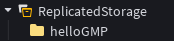
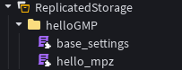
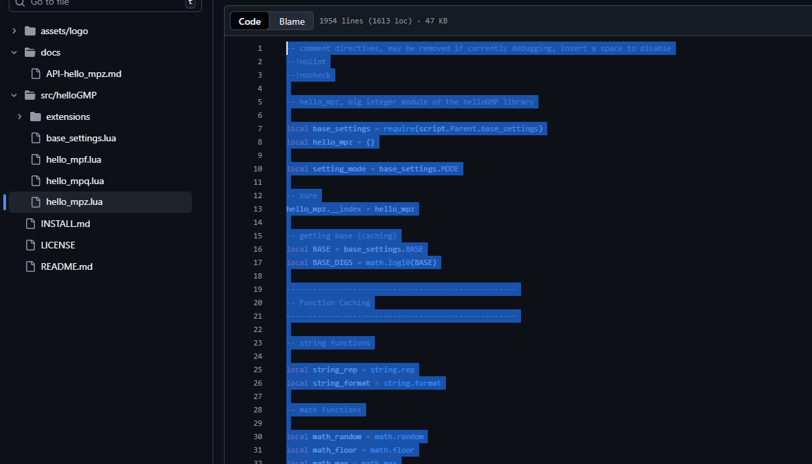
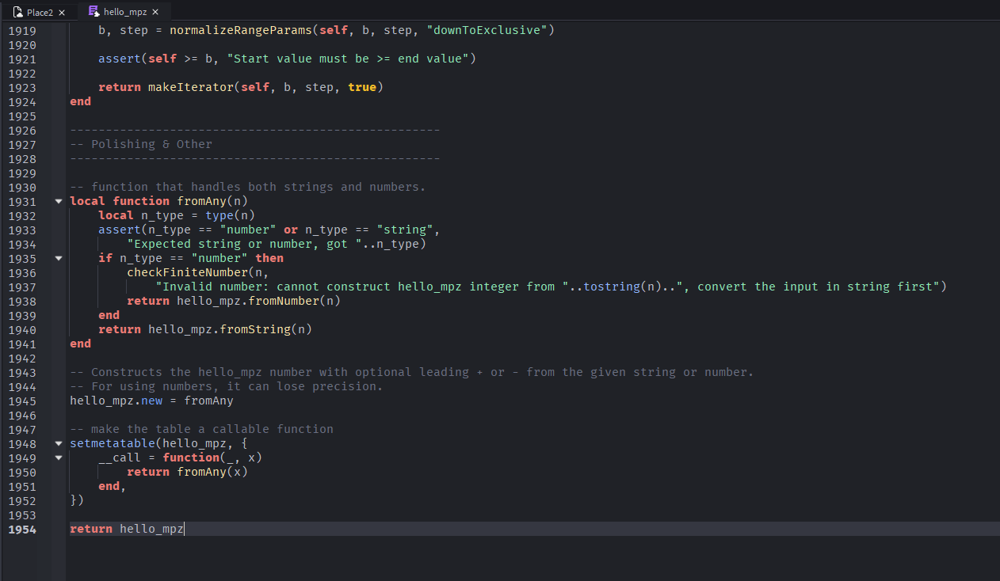

# Getting Started: Getting helloGMP into Roblox Studio/Luau
You are not able to directly import the **helloGMP** library into Roblox studio, but you are able to build it manually into the engine.
The entire library is stored under the `src/` folder in the repo.

## 🧱 Building the Essentials

1. **Create a folder** under `ReplicatedStorage` and name it `helloGMP`.

      
    *Create the `helloGMP` folder inside ReplicatedStorage.*

2. **Create two ModuleScripts** inside the `helloGMP` folder and name them `hello_mpz` and `base_settings`.

      
    *Add two ModuleScripts named `hello_mpz` and `base_settings`.*

3. **Navigate the matching source file names** in the Github repo and open one of them (`src/helloGMP/hello_mpz.lua` or `base_settings.lua`), select the entire code, then copy the code into the clipboard.

      
    *Open the source file on GitHub.*

4. **Paste the code** into the corresponding ModuleScript in Roblox Studio.

      
    *Paste the code into your ModuleScript.*

5. **Repeat the process** for the remaining ModuleScript by opening its matching source file on GitHub and pasting its code into Studio.

### ❓ Confirmation
To check if you have followed the steps correctly, add a Server Script, parent it under `ServerScriptService` and then paste this code into the script.
If the script successfully prints the result correctly then you successfully built the core foundation of **helloGMP**!
```lua
local hello_mpz = require(game.ReplicatedStorage.helloGMP.hello_mpz)

local a = hello_mpz.fromString("437189043214321")
local b = hello_mpz.fromString("43718904328195321")

local result = a * b -- multiplication
print(result) -- 19113425953622149599590952392041
```